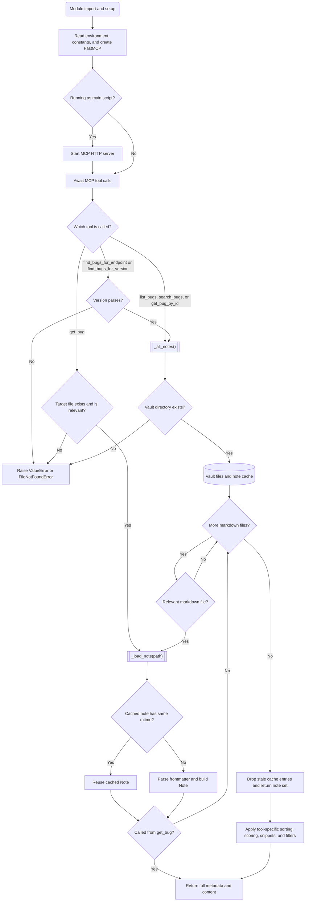

# Bug Tracker MCP Server

## Summary

An MCP Server that leverages notes written in Markdown to track bugs.  The server was written for those
developing Cisco Nexus Dashboard applications which use the REST API, but could easily be
leveraged for other uses.

My use case is providing Claude Code with a resource through which it can determine the
suitability of various Nexus Dashboard endpoints for a given task, and whether an endpoint exhibits
any behavioral bugs and, if so, what version(s) exhibit the behavior and what
version (if any) fixes the behavior.  Notes might also contain workaround(s).

**The actual notes are not included in this repository.**

## Setup

### 1. Install Obsidian and login

### 2. Setup sync with the ND Vault (vault should be in `$HOME/Obsidian/ND`)

### 3. Edit `com.bug-tracker-mcp.plist` such that the paths match your environment

- `OBSIDIAN_VAULT_PATH` should point to your ND vault (e.g. `$HOME/Obsidian/ND`)
- `ProgramArguments` should call `uv server.py` via their full paths e.g.
  - `/Users/arobel/repos/mcp/bug-tracker-mcp/.venv/bin/uv`
  - run
  - `/Users/arobel/repos/mcp/bug-tracker-mcp/server.py`
- `WorkingDirectory` should point to this repository on your host
  - `/Users/arobel/repos/mcp/bug-tracker-mcp`

```bash
cd $HOME/repos/mcp/bug-tracker-mcp
vi com.bug-tracker-mcp.plist
cp com.bug-tracker-mcp.plist $HOME/Library/LaunchAgents
chmod 644 $HOME/Library/LaunchAgents/com.bug-tracker-mcp.plist
```

### 4. (Re)start the LaunchAgent

```bash
launchctl bootout gui/$(id -u)/com.bug-tracker-mcp
launchctl bootstrap gui/$(id -u) $HOME/Library/LaunchAgents/com.bug-tracker-mcp.plist
```

### 5. Edit Claude Code's config on the client Mac to point to this MCP server

- edit $HOME/.claude.json
- Search for the `mcpServers` block
- Add the following (where `mm1e` is the hostname or IP address of the Mac that's hosting the MCP server)

```json
  "mcpServers": {
    "bug-tracker-mcp": {
      "type": "http",
      "url": "http://mm1e:8001/mcp"
    }
  }
```

### 5. Restart Claude Code and check the MCP server status using the `/mcp` slash command

## MCP Server Logic Diagram


